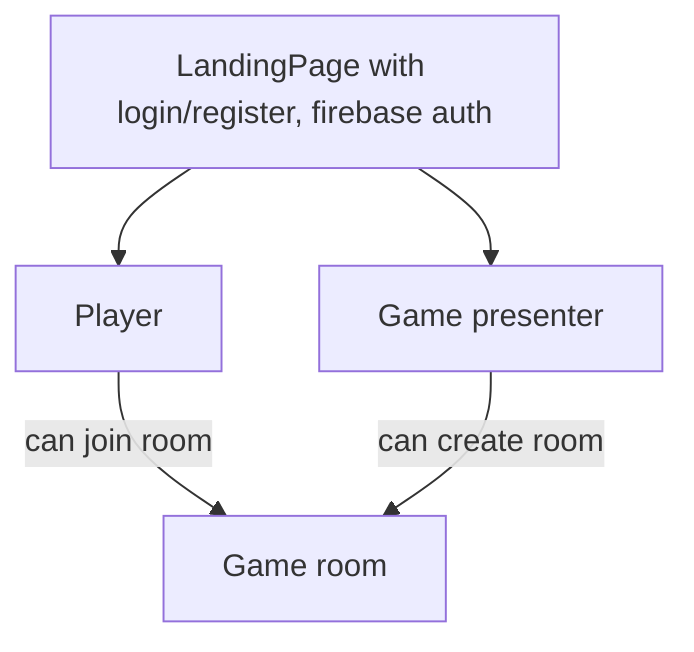

# Appliaction plan and key assumptions
## Key assumptions:
1. Whole app is done in ReactJs Library with Redux as global state manager
2.  At least key features are covered in unit and possibly e2e tests
3.  Game can be viewed on both mobile and desktop devices (RWD)
## Plan and features in descending order:
1. Implementation of blackjack game and its rules <- pure funcionality, no animations and fancy stuff just game engine
2. Creation of connection to [FireBase](https://firebase.google.com/) backend, and support for game host and other players <- multiplayer support
3. Proper authorization dependant on user confidentials
4. Styling and all animations

## In the end game data flow should work like this:

All of the logic should be done only inside game room regarding server and players communication, only exempt from this would be the login/registration in the beggining.
